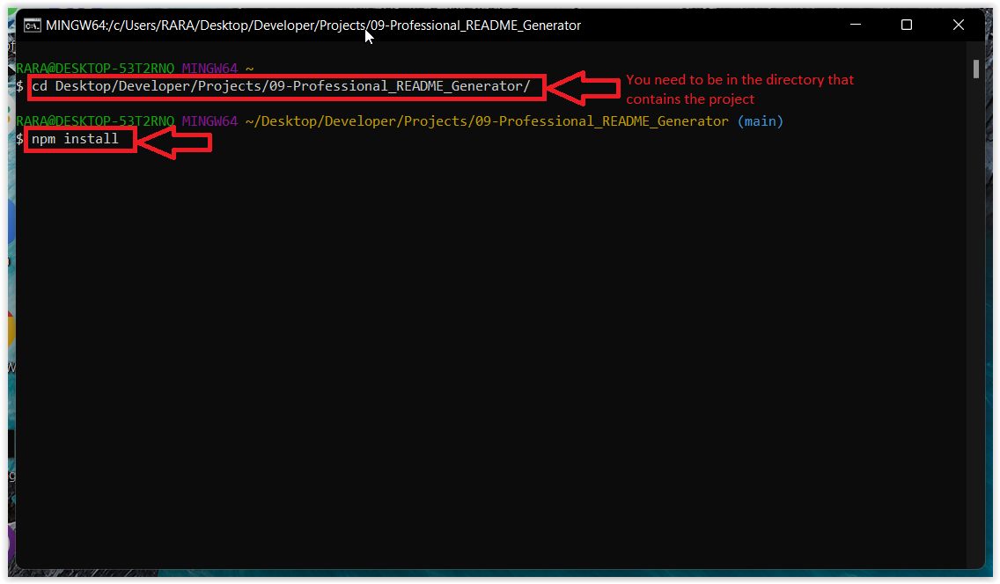
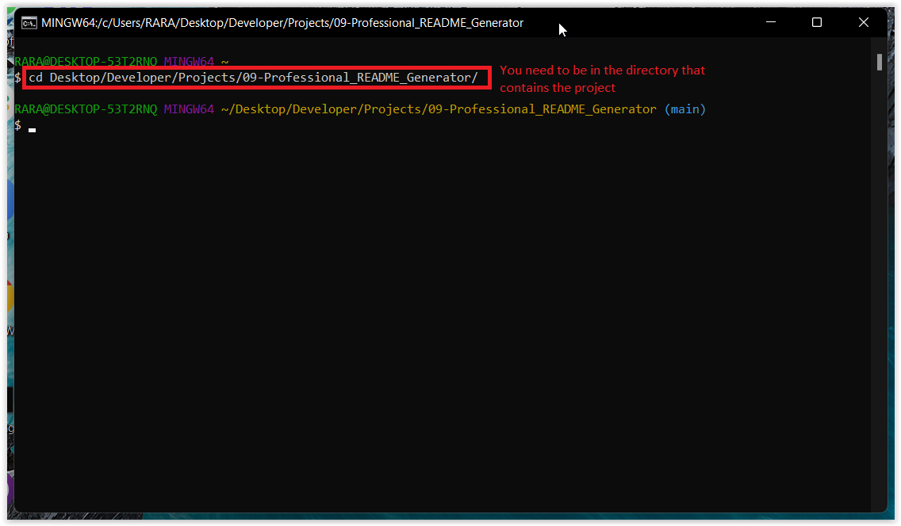
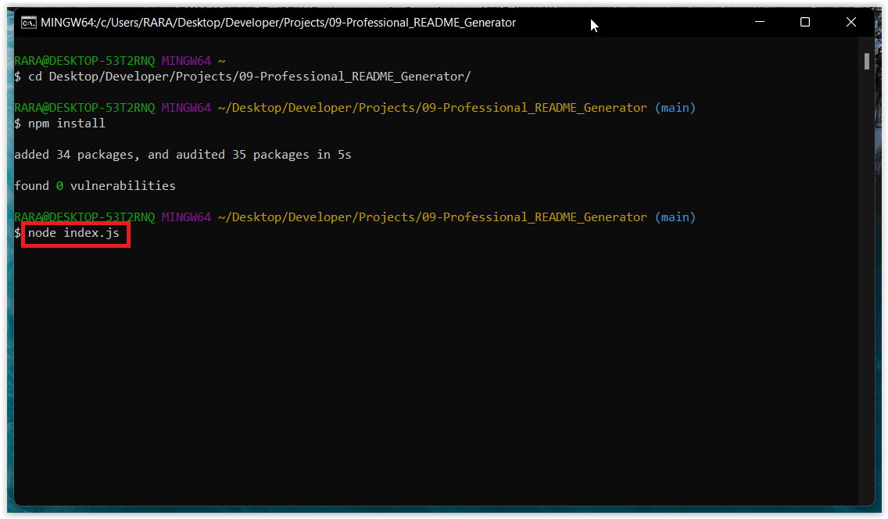
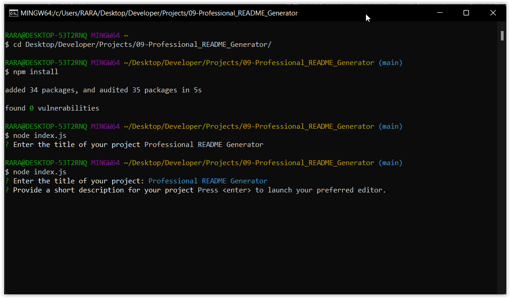
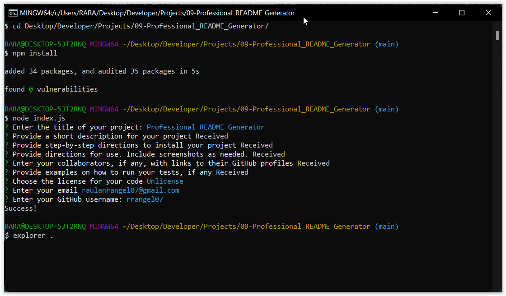

# Professional README Generator 

## Description

As we know, all apps that coders develop should include a README file to help, and guide, the users on how to install the app, explain the proper way to use it and take the most out of it. This represents a repetitive work that us as coders need to do every time we develop a new app, so following the DRY concept for coding I developed a code that will help to generate a README file following a preexistent blueprint.

## Table of Contents

  - [Installation](#installation)
  - [Usage](#usage)
  - [Credits](#credits)
  - [License](#license)

## Installation

- Install Node.js in the computer.
- Then, clone the repository to the computer.
- After cloning the repository, run `npm install`, on the console, to get all the node modules. Make sure the console is in the correct directory before running the `npm install` command.

## Usage

1. On the console, go to the index.js directory

2. Run on the console the following command `node index.js`

3. The console is going to start prompting different questions about your project, some of which you will respond on the console and others will open the editor to allow the user to give more elaborated answers. To include images, make ordered or unordered lists, follow the syntaxis of markdown language. Save before closing the editor, that way the console will get the answer from the temp file.

4. Once you finish answering all the questions, the console will log ‘Success! and the markdown file will be on the root file on the app.  You can do `explorer .` to open the file explorer and have access to the ‘README.md’ file

## Tests

No testing provided.

## Credits

No collaborators to list.

## License

This code is under MIT License license. In order to know what you can and can't do with this code, we recommend to visit the following link [MIT License](https://opensource.org/licenses/MIT).

## Questions

You can contact me through email at raulanrangel07@gmail.com.
Also, through my [GitHub Profile](https://github.com/rrangel07)
